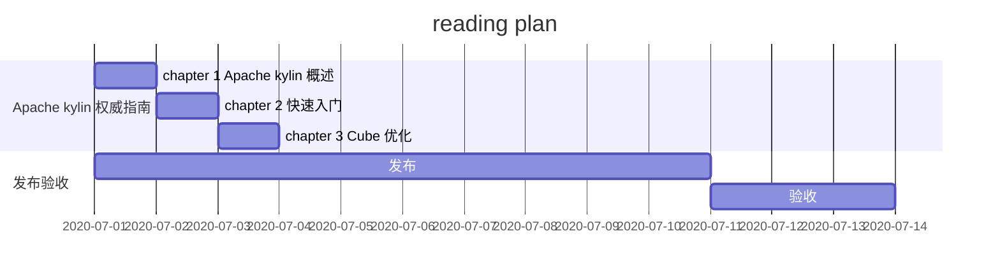
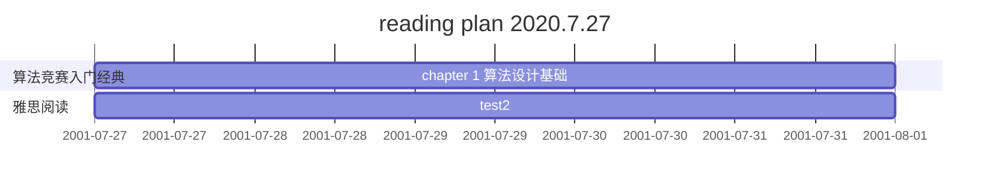
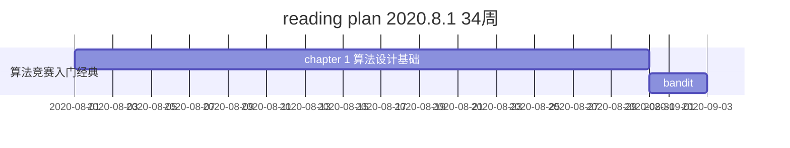
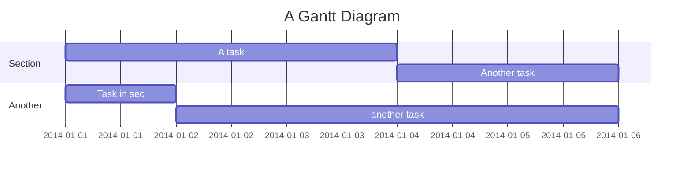

# Learning Plan

---

[TOC]

## 1. learning plan in this week - 2020.7.1

- daily done
  - 2020-07-27
    - [ ] leetcode刷题
    - [ ] 算法竞赛入门经典10页
    - [ ] 波哥推荐系统课

- week plan
  - `2020.7.1` - `2020.7.6`
    - [ ] Apache kylin 权威指南
    - [ ] 深入理解jvm
    - [ ] 算法竞赛 入门经典
    - [ ] 数据算法
    - [ ] Vue
    - [ ] zookeeper
    - [ ] hbase
    - [ ] kafka
    - [ ] Blog

## weeky plan 34 2020.08.17-2020.08.23

daily plan

- [ ] netty
- [ ] leetcode daily
- [ ] eudic words
