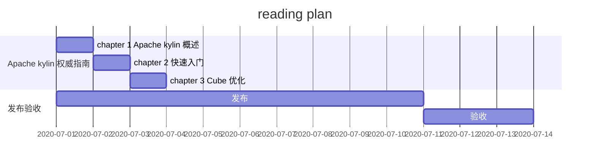

# Learning Plan

---

[TOC]

## 1. learning plan in this week - 2020.7.1

- daily done
  - [ ] leetcode刷题
  - [ ] 

- week plan
  - `2020.7.1` - `2020.7.6`
    - [ ] Apache kylin 权威指南
    - [ ] 深入理解jvm
    - [ ] 算法竞赛 入门经典
    - [ ] 数据算法
    - [ ] Vue
    - [ ] zookeeper
    - [ ] hbase
    - [ ] kafka
    - [ ] Blog
